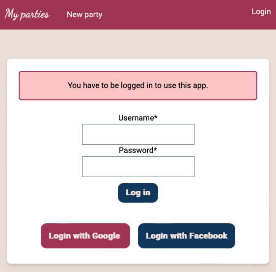

# Full-stack Django with HTMX and Tailwind

Code variant for
[testdriven.io - Course: Full-stack Django with HTMX and Tailwind](https://testdriven.io/courses/django-htmx) without dependencies on `npm` by replacing [django-tailwind](https://github.com/timonweb/django-tailwind) with [django-tailwind-cli](https://github.com/oliverandrich/django-tailwind-cli).

- Setup project: `./scripts/setup_project.sh`
- Optional: change env vars in `.env` file
- Run project in VSCode: `Ctrl+Shift+D`, run launch target `Django Party`.
- Visit end user UI at `http://127.0.0.1:8000`

- Visit admin UI at `http://127.0.0.1:8000/admin`
- Teardown project: `./scripts/teardown_project.sh`

## Optional

- Format JSON fixture files: Open fixture files in `./party/fixtures/*.json` and format them using `Alt+Shift+F`.
- Update tailwindcss cli version: Adjust adjust `TAILWIND_CLI_VERSION` in `./core/settings.py` and execute `./scripts/update_tailwindcsscli.sh`.
- Update htmx version: `./scripts/update_htmx.sh`
- Update alpinejs version: `./scripts/update_htmx.sh`
